# INSPECTION

In this section of the website, we try to understand how the Convolutional Neural Network
is working under the hood.

## Sound files
First of all, we propose to listen to the output of our model and to the ground truth.
These are two examples: in the first one the model trained on the Mozart dataset manages
to detect almost all the melody notes, in second one, instead, it fails. It is nice to
note how the introduction is predicted correctly.

**_Gluck - Die Sommernacht_**

The original one:

sounds/gluck_sommernacht_cm.original.mp3

The prediction made by the model trained on the Mozart dataset:

sounds/gluck_sommernacht_cm.mp3

**_Liszt - Die Glocken Von Marling_**

The original one:

sounds/liszt_die_glocken_von_marling.original.mp3

The prediction made by the model trained on the Mozart dataset:

sounds/liszt_die_glocken_von_marling.mp3

## Saliency with Guided Backpropagation
As first attempt to inspect the network, we computed the saliency map as described in
[this
tutorial](https://github.com/Lasagne/Recipes/blob/master/examples/Saliency%20Maps%20and%20Guided%20Backpropagation.ipynb),
following the Springenberg et al. (2015) method. 

These are some of the images we created. We also computed the histogram of the predicted
values greater than zero and we compared it to the distribution of the ground truth. We
also plotted the value of the computed threshold to visualize the distribution of the
values.

**_Gluck - Die Sommernacht_**
[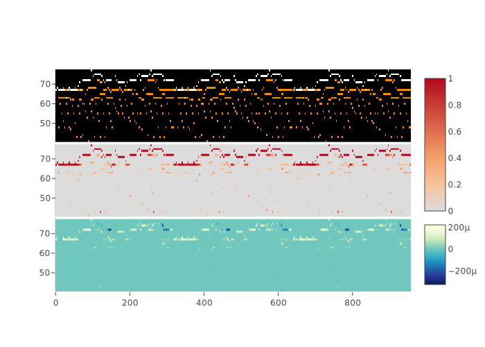](img/gluck_die_sommernacht_saliency.svg)

[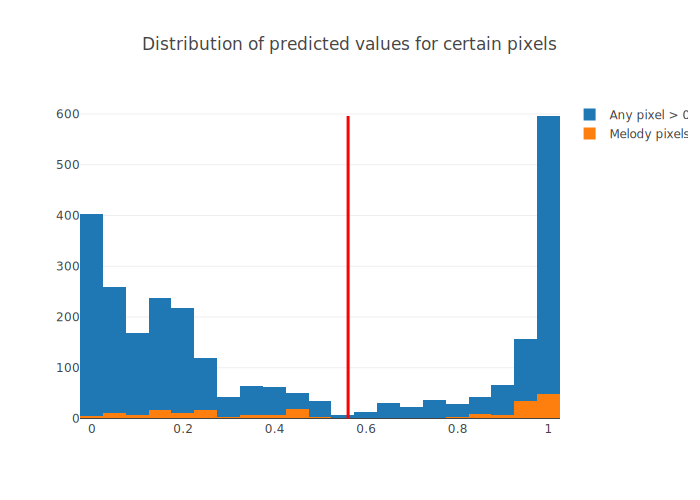](img/gluck_die_sommernacht_distribution.svg)

---

**_Liszt - Die Glocken Von Marling_**

[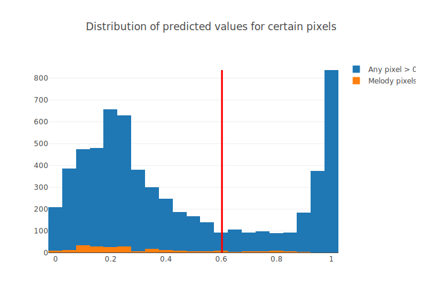](img/liszt_die_glocken_von_marling_distribution.svg)

---

**_Albeniz - Tango_**
[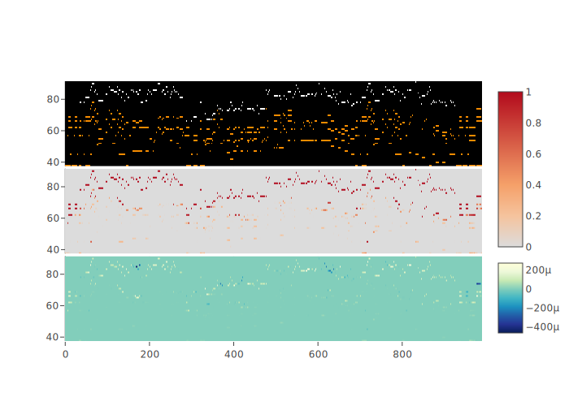](img/albeniz_tango_saliency.svg)

[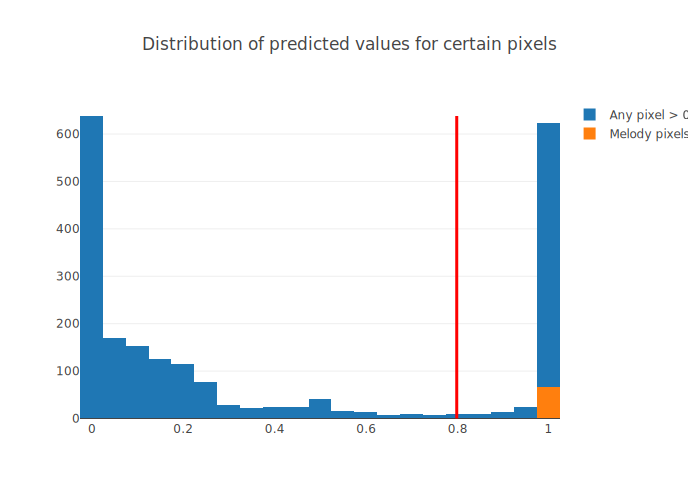](img/albeniz_tango_distribution.svg)

---

**_Schubert - Ave Maria (excerpt)_**
[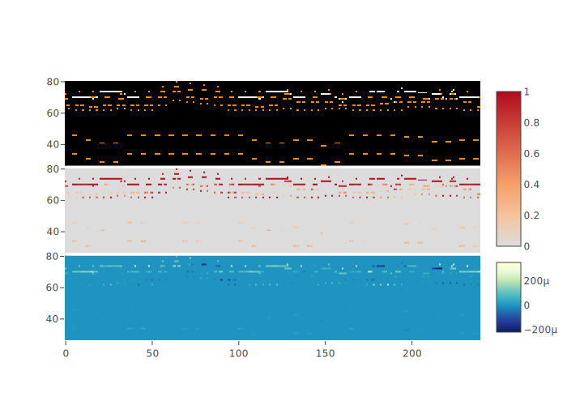](img/schubert_ave_maria_saliency.svg)

[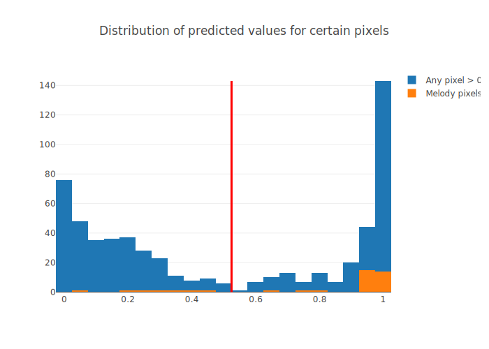](img/schubert_ave_maria_distribution.svg)

---

**_Mozart - KV475 - first movement (excerpt)_**
[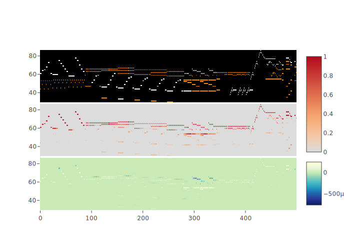](img/mozart_kv475_1_saliency.svg)

[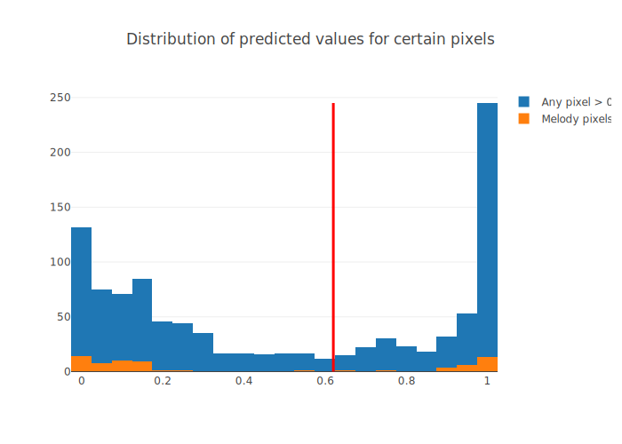](img/mozart_kv475_1_distribution.svg)

## Proposed saliency
Since we were not able to grasp meaningful information from the previous saliency, we
implemented an _ad hoc_ method to inspect the CNN. This method can be used to query any
neural network where the input is of the same size as the output. With this inspection
method, we can ask to the network why a certain region was predicted in a certain way. In
these images, the green rectangle is the subject of the query. The top image shows the
input pianoroll, the middle image shows the CNN prediction, while the bottom image shows
which pixel have contributed to that prediction (positive values) and which have instead
hindered that prediction (negative values). The analyzed excerpt is the first window (two
quarters) of _Die sommernacht_ by Gluck. 

[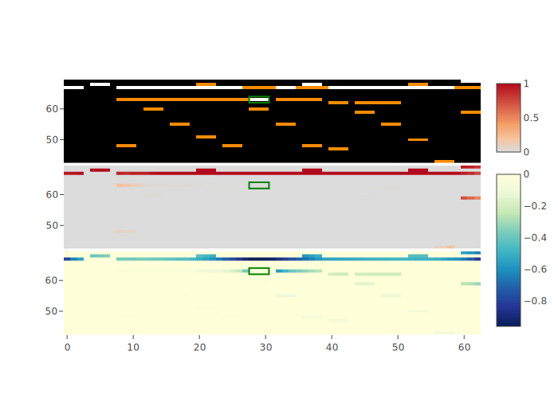](img/gluck_masked_saliency_1.svg)
                                     
[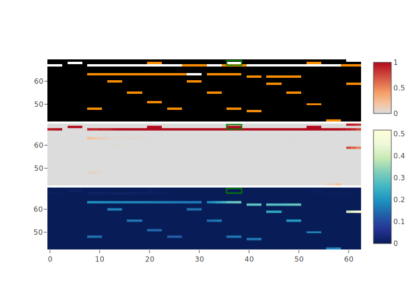](img/gluck_masked_saliency_2.svg)
                                     
[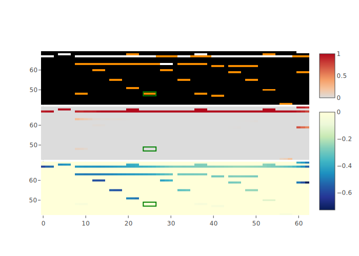](img/gluck_masked_saliency_3.svg)
                                     
[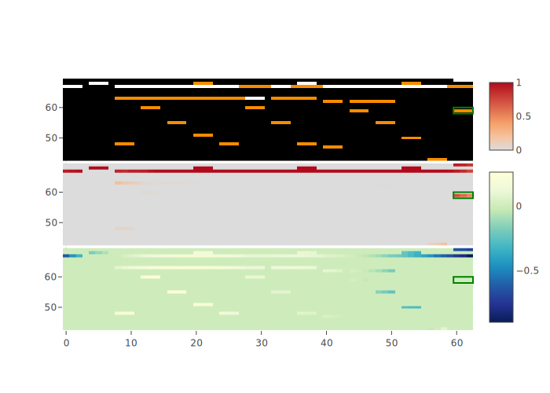](img/gluck_masked_saliency_4.svg)
