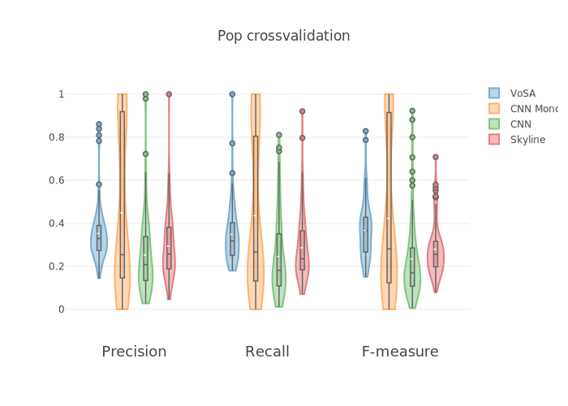
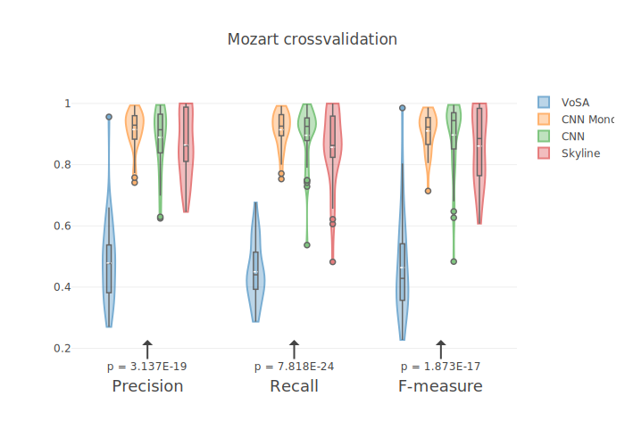
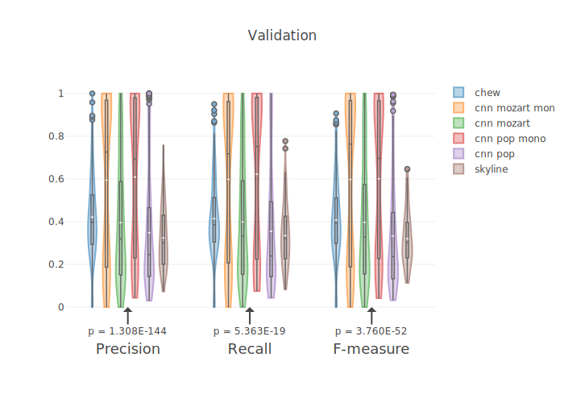
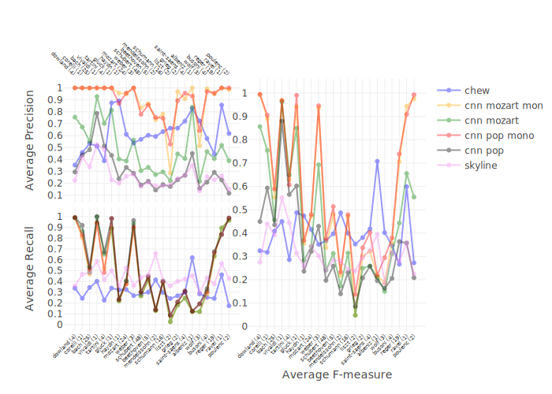

# RESULTS

In this page, you can find all the plots used in the paper plus others.

## Raw results
First of all, here are the raw results for each exeriment.
Each file contains several raw in this format:

```
Piece number: [x]
Precision: [x]
Recall: [x]
F1-measure: [x]
```

The piece number is the index [starting from 0] in the alphabetically sorted list of files of the directory relative to the experiment.

##### Crossvalidation on Pop dataset
* [Chew voice-separation](chew_results-pop.txt) (not `cross`)
* [Skyline](skyline_results-pop.txt) (not `cross`)
* [CNN non mono](cnn_results-pop.txt)
* [CNN mono](cnn_results-pop-mono.txt)

##### Cross-validation on Mozart dataset
* [Chew voice-separation](chew_results-mozart.txt) (not `cross`)
* [Skyline](skyline_results-mozart.txt) (not `cross`)
* [CNN non mono](cnn_results-mozart.txt)
* [CNN mono](cnn_results-mozart-mono.txt)

##### Validation on cultivated music
* [Chew voice-separation](chew_results-validation.txt)
* [Skyline](skyline_validation.txt)
* [CNN non mono](cnn_validation-pop.txt)
* [CNN mono](cnn_validation-pop-mono.txt)
* [CNN non mono](cnn_validation-mozart.txt)
* [CNN mono](cnn_validation-mozart-mono.txt)

## Plots
**N.B.** You can recreate these plots by using the [Jupyter Notebook](interesting_plots.ipynb) provided in this repo.

You can download the high quality SVG plots by clicking on the images. The _p_-value
refers to the Friedman test (for more details about the significance see the full paper).

Results of the cross-validation on the _Pop_ song dataset. The plot shows precision, recall
and F-measure of all the predictions from all the folds.
[](img/pop.svg)

Results of the cross-validation on the _Mozart_ song dataset. The plot shows precision, recall
and F-measure of all the predictions from all the folds.
[](img/mozart.svg)

Results of the _Validation_ on the cultivated dataset. The plot shows precision, recall
and F-measure of all music pieces contained in the dataset.
[](img/validation.svg)


Results of the _Validation_ on the cultivated dataset. The plot shows precision, recall
and F-measure averaged on each author. The numbers between parenthesis near the authors is
the number of songs per each author.
[](img/validation-full.svg)
